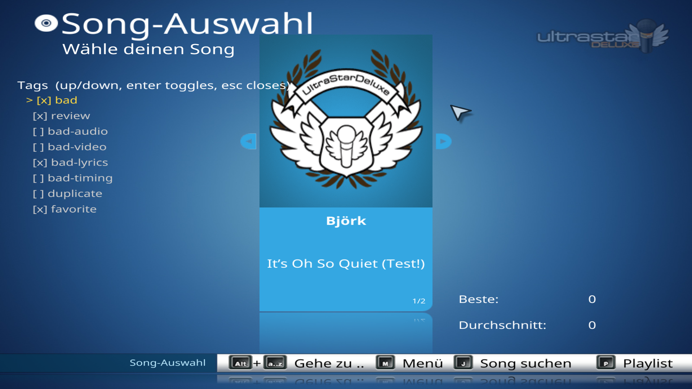
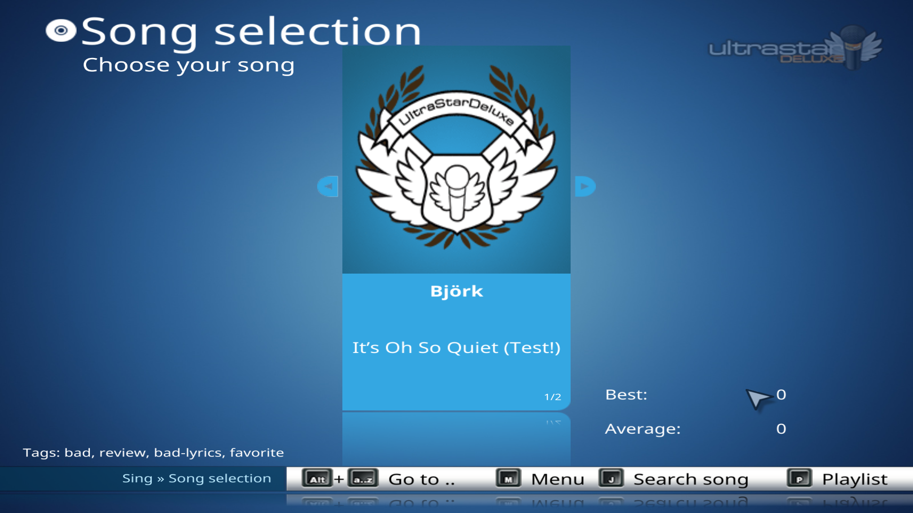

# usdx-tagger

[](https://github.com/ValeHaas/usdx-tagger/actions/workflows/ci.yml)

An [UltraStar Deluxe](https://usdx.eu/) plugin for tagging songs from inside the game.

Press a key while a song is selected, previewing, or playing, and the plugin writes a
`.usdx-user-tags.yaml` file into that song's directory. The tags live next to the song,
so they can be found and processed with ordinary filesystem tools — no database, no
network, no separate service.

The primary use case is quickly flagging problematic songs during a karaoke session,
then reviewing them later.

> **Status:** early development. The requirements are specified in
> [docs/initial_idea.md](docs/initial_idea.md); the implementation is not complete yet.

## Why

During a party, nobody wants to alt-tab out of the game to note that a song has broken
lyrics or out-of-sync audio. Hit `T`, pick a tag, keep singing, sort it out tomorrow
with `grep`.

## What it looks like

Press `T` on the song selection screen and the tag menu opens over it. `[x]` marks a tag the
song already carries, so the same key both adds and removes.



Moving through the songs shows what each one is already tagged with, so a glance tells you
what has been dealt with and what has not.



## Language

The plugin follows whatever language UltraStar Deluxe is set to. Play in German and the menu,
the confirmations and the tag names are German. The screenshot above predates this and shows
what it used to look like: a German game with an English plugin in the same frame.

Translations exist for German, French, Spanish, Italian, Dutch, Portuguese, Polish, Russian
and Swedish. Any other language falls back to English. They have **not** been reviewed by
native speakers, so corrections are welcome — a language lives in one table in
[src/tagger/i18n.lua](src/tagger/i18n.lua), and adding a new one is a data-only change.

**The tag written to the file is never translated.** Only its display name is:

```text
Tags  (auf/ab, Enter schaltet um, Esc schließt)
> [x] schlecht (bad)
  [ ] prüfen (review)
  [ ] Ton fehlerhaft (bad-audio)
```

The file still says `- bad`, so `grep` keeps working across machines and across languages,
which is the entire reason the file exists. The canonical name stays visible in the menu for
the same reason: a player who only ever saw `schlecht` would have no idea what to search for
later.

UltraStar's log also stays English, since log lines end up in bug reports read by people who
do not share the player's language.

Set `language=` in the config to pin the plugin to one language regardless of the game, or
leave it at `auto`. How the game's setting is discovered, and what else turned out to be
reachable from a plugin, is written up in [docs/i18n.md](docs/i18n.md).

## Tag file

Each tagged song directory gets one extra file:

```text
Songs/
└── Artist - Song Title/
    ├── Artist - Song Title.txt
    ├── Artist - Song Title.mp3
    └── .usdx-user-tags.yaml
```

```yaml
# UltraStar Deluxe song tags set by the user
# Created by plugin https://github.com/ValeHaas/usdx-tagger
version: 0.1.0
tags:
  - bad-audio
  - review
```

The format is documented in full — including optional metadata, versioning, and the
minimal accepted file — in [docs/initial_idea.md](docs/initial_idea.md#4-yaml-file-format).

Notes on the format:

- `version` is the [semantic version](https://semver.org) of the plugin that last wrote
  the file. It may be omitted, and an unfamiliar value is read rather than rejected, so a
  file written by a newer plugin never costs you your tags.
- Tag names are arbitrary. They are trimmed, compared case-insensitively, and stored
  lowercase, so `Bad-Audio`, ` bad-audio `, and `bad-audio` are the same tag.
- Tag order is stable; new tags are appended.
- When the last tag is removed, the file is deleted by default (configurable), which
  keeps filesystem searches meaningful.

Suggested starting tags: `bad`, `review`, `bad-audio`, `bad-video`, `bad-lyrics`,
`bad-timing`, `duplicate`, `favorite`.

## Default key bindings

| Key      | Action                                  |
|----------|-----------------------------------------|
| `T`      | Open the tag menu                       |
| `Ctrl+T` | Show the current song's tags            |

In the menu: up/down to move, `Enter` to toggle the highlighted tag, `Esc` to close. A
tag the song already carries is marked `[x]`, and toggling it removes it again, so one
key covers both adding and removing. The menu stays open after a toggle so several tags
can be set in one visit.

Any key the plugin has no binding for is passed straight through to UltraStar Deluxe, so
its own controls keep working.

## Configuration

Configuration lives in the writable user directory that UltraStar Deluxe reports — never
in the song library. On Windows that is `%APPDATA%\ultrastardx\usdx-tagger.ini`, or the
executable's directory for a portable install.

```ini
enabled=true
quick_tag=bad
tag_menu_key=T
show_tags_key=Ctrl+T
show_notifications=true
show_existing_tags=true
delete_empty_tag_file=true
notification_ms=2500
language=auto
```

`quick_tag` is the tag placed first in the menu, so the most common choice is one
keystroke away.

`language` is `auto` — follow UltraStar — or one of `English`, `German`, `French`, `Spanish`,
`Italian`, `Dutch`, `Portuguese`, `Polish`, `Russian`, `Swedish`. A name with no translation
is reported in the log instead of silently showing English.

Key bindings accept modifiers: `T`, `Shift+T`, `Ctrl+T`, `Alt+F5`, and the named keys
`Space`, `Escape`, `Return`, `Tab`, the arrows, and `F1`-`F12`.

A missing file, a missing key, or a malformed value each fall back to the default and are
noted in UltraStar Deluxe's log rather than failing to load.

## Working with tags outside the game

The whole point of a plain YAML file per song directory is that you don't need this
plugin — or UltraStar Deluxe — to use the data.

Find every tagged song:

```bash
find Songs -name '.usdx-user-tags.yaml'
```

List the directories of everything tagged `bad`:

```bash
grep -rl --include='.usdx-user-tags.yaml' -e '- bad$' Songs | xargs -n1 dirname
```

Move songs marked `review` into a quarantine folder:

```bash
grep -rl --include='.usdx-user-tags.yaml' -e '- review$' Songs \
  | xargs -n1 dirname \
  | xargs -I{} mv {} Quarantine/
```

PowerShell equivalent:

```powershell
Get-ChildItem -Recurse -Force -Filter '.usdx-user-tags.yaml' |
  Where-Object { (Get-Content $_.FullName) -match '^\s*-\s*bad\s*$' } |
  ForEach-Object { $_.Directory.FullName }
```

## Design

UltraStar-specific and platform-specific code is isolated behind adapters, so the tag
logic can be tested — and reused by other tools — without the game running.

```text
src/tagger/
├── version.lua   -- the semantic version, single source of truth
├── i18n.lua      -- message catalogues and language resolution
├── tagset.lua    -- tag naming and set operations   (TagService + TagValidator)
├── tagfile.lua   -- reads and writes the tag file   (TagFileRepository)
├── keys.lua      -- key bindings and matching
├── config.lua    -- settings                         (PluginConfig)
├── notify.lua    -- on-screen messages
├── adapter.lua   -- the only module touching Usdx.*  (UltraStarAdapter)
└── init.lua      -- configuration, key handling, tag menu
```

Only `adapter.lua` knows UltraStar Deluxe exists. Everything else is plain Lua over plain
strings and files, which is what lets the test suite run the whole tag engine — and drive
the built plugin end to end — with the game absent.

`notify.lua` takes its clock and its drawing function as parameters rather than reaching
for them, for the same reason.

## Development

Requires a Lua interpreter; nothing else, and no luarocks.

```bash
lua spec/run.lua           # unit tests for the engine, no game needed
lua build/bundle.lua       # build dist/usdx-tagger.usdx
lua spec/bundle_check.lua  # drive the built plugin with UltraStar stubbed out
luacheck src spec build    # lint, if you have it
```

### Git hooks

The same checks CI runs are available locally:

```bash
bash .githooks/install.sh
```

That sets `core.hooksPath`, so the hooks stay versioned and an update arrives with a
normal `git pull` — nothing is copied into `.git/hooks`.

| Hook | Runs |
|------|------|
| `pre-commit` | syntax, lint, unit tests |
| `pre-push` | the above, plus the plugin build, the built plugin, and the version checks |

`pre-commit` deliberately tests the **staged** tree, not your working directory: it
exports the index to a temporary directory and runs there. Committing a subset of your
changes is common, and the question worth answering is whether *that* passes.

`pre-push` additionally checks, when you push a `v*` tag, that the tag matches
`version.lua` — the release workflow would refuse it otherwise, and finding out before
the push is cheaper.

Both hooks find a Lua interpreter themselves, including one installed somewhere not on
`PATH`. Point `USDX_TAGGER_LUA` at a specific one if you need to. `luacheck` is optional
and is skipped with a note when it is absent.

Skip once with `git commit --no-verify`, or set `USDX_TAGGER_SKIP_HOOKS=1` to disable
both.

The plugin ships as a single `.usdx` file because UltraStar resolves only
`require('Usdx.*')` and its plugin directory is read-only in a release build, so
`build/bundle.lua` inlines the modules. It also runs the generated main chunk in a bare
environment as a build step — UltraStar executes a plugin's main chunk *before* opening
the standard library, and that check catches the resulting breakage at build time instead
of in the game.

`dist/` is not committed; build it when you need it, or take
`usdx-tagger.usdx` from a [release](https://github.com/ValeHaas/usdx-tagger/releases) or
from a CI run's artifacts.

### What CI checks

Every push and pull request runs three jobs:

- **Lint** — `luacheck`, configured with `std = 'min'`. That standard is the intersection
  of every Lua standard library, so the lint doubles as a portability gate: using
  something that exists in 5.4 but not 5.1 fails the build.
- **Test** — the full suite on Lua 5.1, 5.2, 5.3 and 5.4 on Linux, plus 5.4 on Windows
  and macOS. UltraStar Deluxe links against whichever Lua its build used, and its own
  `COMPILING.md` allows any of 5.1–5.4, so all of them have to work. The Windows and
  macOS legs exist because the test runner and the tag writer both have
  platform-specific paths. Each leg syntax-checks every file, runs the unit tests, builds
  the plugin, and then drives the built plugin with the game stubbed out.
- **Version** — `src/tagger/version.lua` is a valid semantic version, and the value the
  tag writer stamps into song folders matches it.

### Cutting a release

Bump `src/tagger/version.lua`, commit, then tag it:

```bash
git tag v0.2.0 && git push origin v0.2.0
```

The release workflow refuses to publish if the tag and `version.lua` disagree — otherwise
the download would stamp a different version into users' files than the one they think
they installed. It then runs the tests, builds the plugin, and attaches
`usdx-tagger.usdx` to a GitHub release.

## Guarantees

The plugin owns exactly one file per song directory and nothing else. It will never:

- delete, rename, or move song directories,
- touch the `.txt`, audio, video, cover, or MIDI files,
- modify UltraStar song metadata by default,
- execute shell commands,
- require a database, network access, or administrator privileges.

Writes to `.usdx-user-tags.yaml` are atomic (temp file in the same directory, then
replace), YAML is parsed in safe mode with no object deserialization, and unknown fields
are preserved where possible. Errors — no current song, read-only directory, invalid
YAML, permission denied — surface as a notification and a log entry, never as a crash.

Song title and artist may be stored in the file for diagnostics, but the authoritative
identity of a song is always its actual filesystem path, obtained from UltraStar Deluxe
rather than reconstructed from artist and title.

## Platform support

Windows, Linux, and macOS, as far as the UltraStar Deluxe plugin API allows. Spaces and
punctuation, nested song directories, multiple song libraries, and writable network
mounts are all supported.

Unicode paths work, with one caveat on Windows: Lua's `io` library reaches the filesystem
through the narrow C runtime, which reads paths in the active ANSI code page. A song
folder whose name needs characters that code page cannot represent is not openable from a
plugin at all. Names within the code page — `Björk`, `Motörhead`, `Sigur Rós` — are fine.
The failure is reported, never silently ignored.

## Installation

The plugin needs an UltraStar Deluxe build that exposes the selected song and a key hook
to Lua. A stock build has neither, so a patched game is required for now; what is missing
and why is written up in [docs/usdx-api-gaps.md](docs/usdx-api-gaps.md).

With such a build, drop `dist/usdx-tagger.usdx` into its `plugins/` directory. A release
build on Windows keeps that directory under `Program Files`, which needs administrator
rights; a build from source has a writable `game/plugins/` instead.

To confirm it loaded, look for `usdx-tagger` in `Error.log`:

```text
INFO:   usdx-tagger: ready, tag menu on "T"
```

## Contributing

Contributions are welcome. Tag-file behavior is expected to be covered by unit tests that
run without UltraStar Deluxe; see the testing requirements in
[docs/initial_idea.md](docs/initial_idea.md#14-testing-requirements).

## License

[GNU General Public License v3.0](LICENSE)
